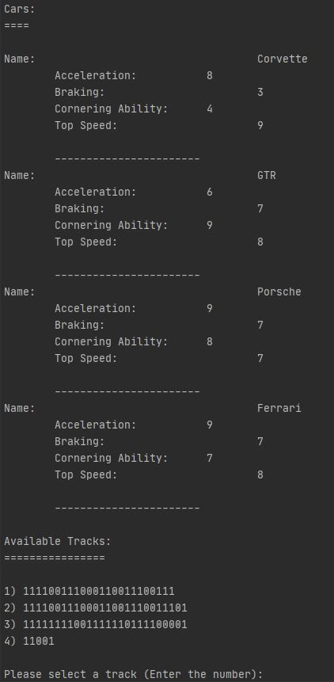
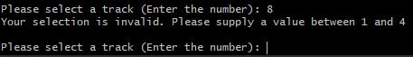
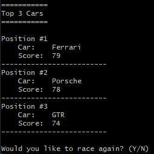

# Getting Started

### Pre-Requisites
MySql and Java 8 is required for this application to execute.

A database needs to be created with the name 'car_racing'

##### Steps To Create A Database
* Launch your command-line editor
* Go to the *bin* folder of your MySql installation directory
* Login to MySql (This application is configured to use a user named *admin* but you may change it according to what you have created)
>               mysql.exe -h localhost -u admin -p
* Once at the mysql prompt, create the database by entering the following:
>               create database car_racing;

You may read more on this [here](https://dev.mysql.com/doc/refman/8.0/en/creating-database.html). 

### Application Configuration

##### Database Migration
The application uses a database migration tool called [Flyway](https://flywaydb.org/documentation/usage/gradle/). 
Its configuration is located in the *build.gradle* file, 
which also hosts the library dependencies (downloaded automatically during execution) for this application.

The sql migration scripts are located in this project under *src/main/resources/db/migration/mysql* 

The *schema* file is used to create the database tables, while the *data* file is used to insert the records.
The tracks for the races have been inserted into the database, and will be available for selection at application startup.

The above executes as the application launches.

##### Application Database Configuration
This lies in the *database.properties* file, and is used by the application to configure database connections to query the database.

### Application Build And Execution
Gradle is a build automation tool that is also used for execution of this application.
This project is pre-packaged with a gradle wrapper that is used for this purpose.

To build this project, run the following:
>               gradlew clean build

To execute, proceed to the base directory of this project and run the following:
>               gradlew run --console=plain

Output following startup should be as in the following screenshot:

The tracks are numbered, so if the 1st track is desired, then *1* should be entered at the prompt.

If an incorrect value is entered, an error message is displayed and you will be prompted to re-enter your selection:

The results (as well as the option to run another race) of the race are then displayed as in the following screenshot:

### Application Modification
If you wish to add additional cars/tracks or change existing ones, you'd have to create new flyway sql scripts.
More details on the structure of script filenames may be read [here](https://flywaydb.org/documentation/concepts/migrations#naming). 

Another way (only to be done during development) is as follows:
* Modify the V1_0_1__data.sql script
* Remove the record for that script in the *flyway_schema_history* database table
* Run the application
